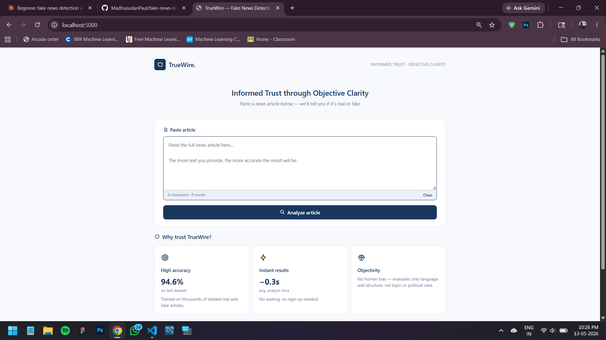
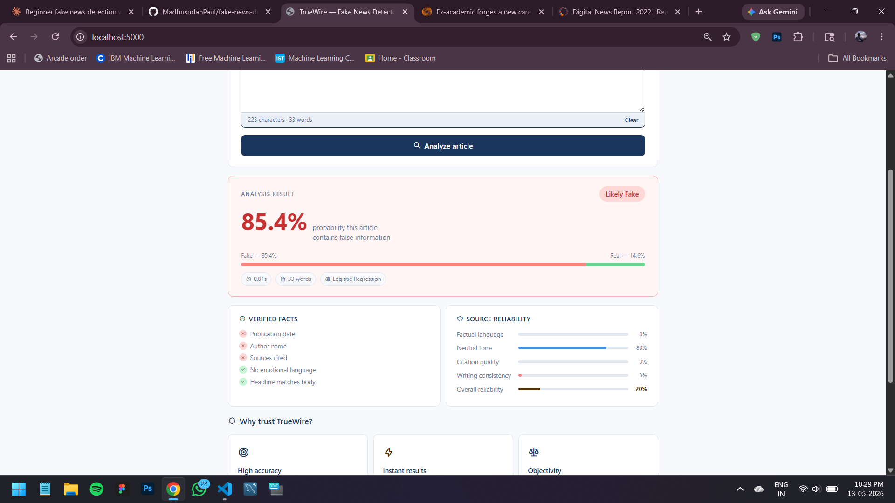

# TrueWire — Fake News Detection System

> **Informed Trust through Objective Clarity**

A machine learning web application that analyzes news articles and predicts whether they are **real or fake**, with confidence scores, source reliability analysis, and verified fact checks.

---

## Overview

TrueWire uses **TF-IDF vectorization** and **Logistic Regression** trained on a labeled dataset of real and fake news articles. Users paste any news article and instantly receive a detailed analysis including prediction confidence, source reliability scores, and writing quality indicators.

---

## Features

- Fake / Real prediction with confidence percentage
- Dual-class probability breakdown (Fake vs Real)
- Source reliability scoring — factual language, neutral tone, citation quality
- Verified fact checks — author presence, date, emotional language detection
- Clean minimal UI with real-time character and word count
- Sub-second analysis time (~0.3s)

---

## Tech Stack

| Layer | Technology |
|---|---|
| Backend | Python, Flask |
| Machine Learning | Scikit-learn, TF-IDF, Logistic Regression |
| Frontend | HTML, CSS, JavaScript |
| Model Persistence | Pickle |
| Dataset | Kaggle Fake News Detection Dataset |

---

## Project Structure

```
fake-news-detector/
├── app.py                  # Flask server and ML inference
├── train_model.py          # Model training script
├── requirements.txt        # Python dependencies
├── model/
│   ├── model.pkl           # Trained Logistic Regression model
│   └── vectorizer.pkl      # Fitted TF-IDF vectorizer
├── dataset/                # Training data (not included)
├── templates/
│   └── index.html          # Frontend webpage
└── static/
    └── style.css           # Stylesheet
```

---

## Model Performance

| Metric | Score |
|---|---|
| Accuracy | ~94.6% |
| Algorithm | Logistic Regression |
| Vectorizer | TF-IDF (5000 features, bigrams) |
| Train/Test Split | 80% / 20% |

---

## Getting Started

**1. Install dependencies**
```bash
pip install flask scikit-learn pandas numpy
```

**2. Add dataset**

Download `Fake.csv` and `True.csv` from [Kaggle](https://www.kaggle.com/datasets/emineyetm/fake-news-detection-datasets) and place them in the `dataset/` folder.

**3. Train the model**
```bash
python train_model.py
```

**4. Run the app**
```bash
python app.py
```

Open `http://localhost:5000` in your browser.

---

## How It Works

1. User pastes a news article into the web interface
2. Text is sent to the Flask backend via a POST request
3. TF-IDF vectorizer converts the text into numerical features
4. Logistic Regression model predicts the probability of the article being fake
5. Additional heuristics analyze writing tone, citations, and language patterns
6. Result is returned as JSON and rendered on the page

---

## Dataset

- Source: [Kaggle — Fake News Detection Datasets](https://www.kaggle.com/datasets/emineyetm/fake-news-detection-datasets)
- `Fake.csv` — 23,502 fake news articles
- `True.csv` — 21,417 real news articles
- Total — ~45,000 labeled articles

---

## Screenshots

> Home page with article input



> Analysis result with confidence scores



---

## Author

**Madhusudan Paul**
